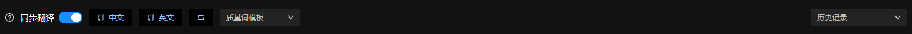

# sd-webui-iiooo-tag

## install

```
    npm install sd-webui-power-share
```

## useage



- 同步翻译——当开启同步翻译时，对生成的词条列表权重、排序等修改，都会同步到文本区域
- 中文——复制当前词条列表的中文名称
- 英文——复制当前词条列表的英文名称
- 排序——对当前词条列表通过权重来进行排序
- 质量词模板——提供给用户一些质量词
- 历史记录——缓存用户的翻译记录
